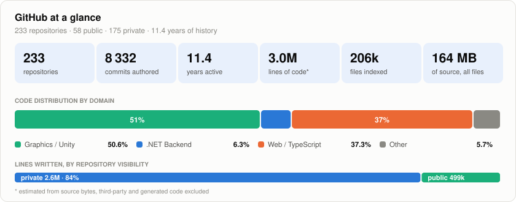
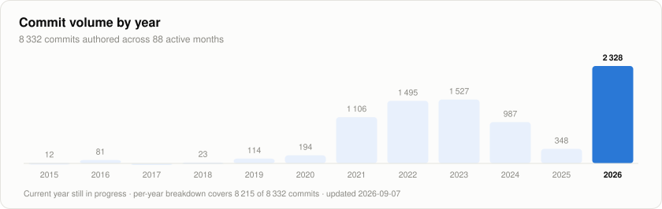
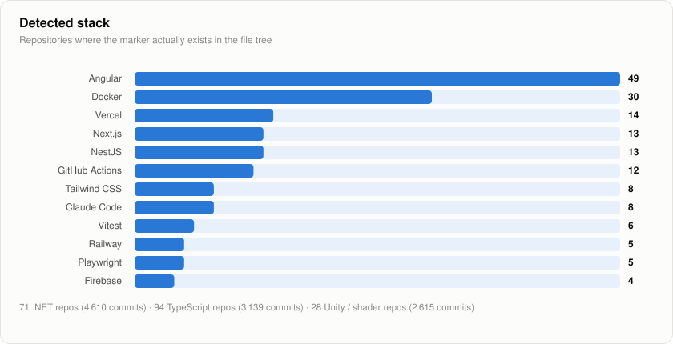
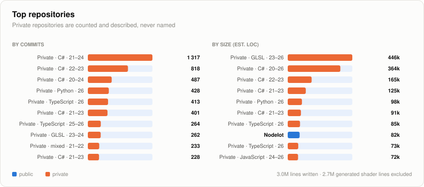
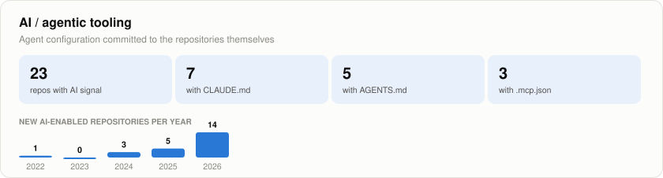
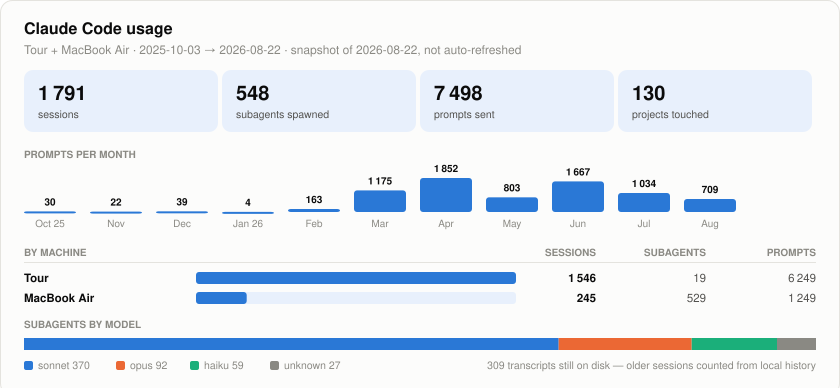

<h1 align="center">Hi, I'm Alexandre Amiel 👋</h1>

<i>aka <b>sachaamm</b></i>

  <b>Senior Full-Stack Engineer</b> &nbsp;•&nbsp; .NET / C# &nbsp;•&nbsp; Angular &nbsp;•&nbsp; AI Integration

  I build and modernize production web applications, and design agentic tooling
  (LLM orchestration, MCP servers, n8n pipelines) that removes manual work. 
  I also teach fullstack TypeScript at ESGI, and run <b>Indie Island Studio</b> on the side.

  Marseille, France 🇫🇷 &nbsp;|&nbsp; US citizen &nbsp;|&nbsp; Open to remote roles

  
  
  

---

### 🛠️ Tech Stack

  
  
  
  
   
  
  
  
  
   
  
  
  
   
  
  
  
  

---

### 📊 GitHub Stats

> Regenerated weekly from the GitHub API across **all 229 repositories — private ones included**.
> Private repos are counted in every figure. Ten of them are named — exactly those
> listed in the *Top repositories* table. The other 161 become `private-042` in the raw
> data itself, before anything is written to disk. See [SETUP.md](SETUP.md) for how it works.

<picture>
  <source media="(prefers-color-scheme: dark)" srcset="assets/overview-dark.svg">
  
</picture>

<picture>
  <source media="(prefers-color-scheme: dark)" srcset="assets/activity-dark.svg">
  
</picture>

<picture>
  <source media="(prefers-color-scheme: dark)" srcset="assets/stack-dark.svg">
  
</picture>

<picture>
  <source media="(prefers-color-scheme: dark)" srcset="assets/repos-dark.svg">
  
</picture>

<picture>
  <source media="(prefers-color-scheme: dark)" srcset="assets/agentic-dark.svg">
  
</picture>

---

### 🤖 Claude Code

> How much of the work above actually runs through agents. Unlike every card
> on this page, this one is **not** refreshed weekly: Claude Code writes only
> to `~/.claude` on the machine you sit at, and no API exposes it — so this is
> a hand-taken snapshot from **one laptop**, and a floor rather than a total.
> My desktop tower is not counted yet. Project names never leave the machine;
> only counters do. Regenerate with `python3 scripts/collect_claude.py`.

<picture>
  <source media="(prefers-color-scheme: dark)" srcset="assets/claude-dark.svg">
  
</picture>

---

### 🚀 Featured Projects

| Project | Description | Tech |
|---------|-------------|------|
| [**formation-ts-nest-angular**](https://github.com/sachaamm/formation-ts-nest-angular) | Fullstack TypeScript course (NestJS + Angular) I designed and teach at ESGI | `TypeScript` · `Angular` · `NestJS` |
| [**dotnet-spa-auth-template**](https://github.com/sachaamm/dotnet-spa-auth-template) | Production-ready authentication starter for ASP.NET Core + SPA front-ends | `C#` · `.NET` |
| [**linkedin-setter-template**](https://github.com/sachaamm/linkedin-setter-template) | Agentic appointment-setting chatbot — n8n orchestration + hosted decision brain | `n8n` · `LLM` |
| [**deploy-unity-mirror-with-docker-and-kubernetes**](https://github.com/sachaamm/deploy-unity-mirror-with-docker-and-kubernetes-helloworld) | Containerizing and orchestrating a stateful realtime server on Kubernetes | `Docker` · `K8s` · `C#` |
| [**apify-reddit-keyword-scraper**](https://github.com/sachaamm/apify-reddit-keyword-scraper) | Published Apify actor that scrapes Reddit by keyword | `JavaScript` |
| [**my-tab-switcher-chrome-extension**](https://github.com/sachaamm/my-tab-switcher-chrome-extension) | Chrome extension to jump to the previous or next tab with a shortcut | `JavaScript` |

➡️ Browse everything on the [repositories tab](https://github.com/sachaamm?tab=repositories).

---

### 📫 Reach me

  
  

---

### 🏝️ Indie Island Studio

My indie game studio — where I ship Unity games on the side:

  
  
  
  

